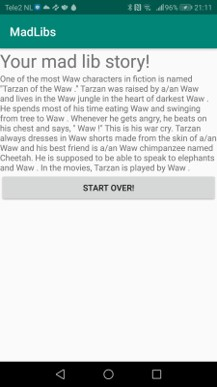
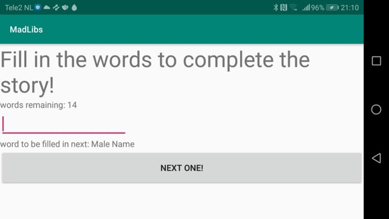
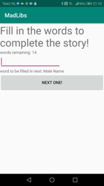
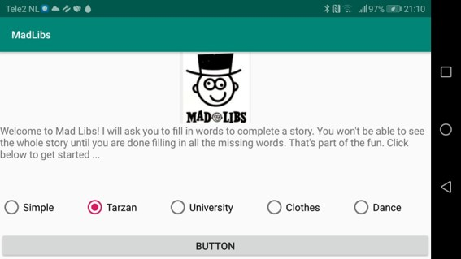

# MadLibs

Spel-programma om een grappig verhaaltje te maken.

volledig verhaal:

woorden invullen horizontaal:

woorden invullen verticaal:

Verhaal kiezen horizontaal:

Verhaal kiezen verticaal:

